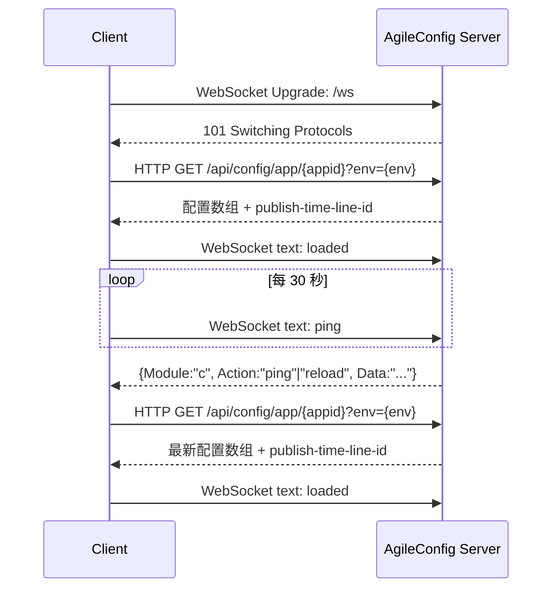

# AgileConfig 配置客户端接入协议

本文档描述 AgileConfig 配置中心的客户端通信协议，供 Java、Go、Python、Node.js、Rust 等语言实现兼容客户端。范围仅包括配置拉取与配置变更通知；服务注册、心跳和服务发现接口不在本文档范围内。

## 概览

客户端使用两条通道：

| 通道 | 用途 | 是否必需 |
| --- | --- | --- |
| WebSocket | 接收配置变更通知、版本检查与服务端下线指令 | 推荐；连接失败不影响首次获取配置 |
| HTTP | 获取完整配置快照 | 必需 |

WebSocket 不直接传送配置内容。客户端首次启动、收到刷新通知、发现版本不一致以及 WebSocket 重连成功后，均应通过 HTTP 重新获取完整配置。



若 WebSocket 升级失败，客户端仍必须继续执行 HTTP 拉取；之后按重连策略再次尝试 WebSocket。

## 客户端初始化参数

| 参数 | 必填 | 说明 |
| --- | --- | --- |
| `appid` | 是 | 应用 ID，与服务端控制台中的应用 ID 一致 |
| `secret` | 是 | 应用密钥，用于 Basic 认证 |
| `nodes` | 是 | 服务端 HTTP 基地址列表，以逗号分隔，例如 `https://config-1.example.com,https://config-2.example.com` |
| `env` | 否 | 目标环境。官方 .NET 客户端会转为大写；为空时由服务端决定默认环境 |
| `name` | 否 | 客户端名称，仅用于服务端展示 |
| `tag` | 否 | 客户端标签，仅用于服务端展示 |
| `client-v` | 否 | 客户端实现版本。建议填写语义化版本，如 `1.0.0` |

多节点应逐个尝试。官方客户端每轮从随机节点开始，直到某一节点成功或全部失败。

## 认证

HTTP 请求和 WebSocket Upgrade 均使用下列认证信息：

```text
Authorization: Basic base64(UTF-8("{appid}:{secret}"))
appid: {URI-encoded appid}
```

例如，`appid=demo`、`secret=s3cr3t` 时：

```text
Authorization: Basic ZGVtbzpzM2NyM3Q=
appid: demo
```

`appid` 同时出现在路径或请求头中。实现客户端时应对路径段和查询参数进行 URI 编码，避免应用 ID、名称或标签包含保留字符时产生歧义。

## WebSocket 连接

### 地址转换

对每个 `nodes` 中的 HTTP 基地址，按下列规则生成 WebSocket 地址：

| HTTP 基地址 | WebSocket 地址 |
| --- | --- |
| `http://host` | `ws://host/ws` |
| `http://host/` | `ws://host/ws` |
| `https://host/base` | `wss://host/base/ws` |

连接 URL：

```text
ws[s]://{host}[/base]/ws?client_name={urlencoded-name}&client_tag={urlencoded-tag}
```

即使 `name` 或 `tag` 为空，建议仍发送两个查询参数：`client_name=&client_tag=`。

### Upgrade 请求头

除 WebSocket 标准 Upgrade 请求头外，发送：

```text
appid: {URI-encoded appid}
env: {ENV}
Authorization: Basic {base64(appid:secret)}
client-v: {client-version}
```

使用 `wss://` 时必须验证服务器 TLS 证书。不要为方便调试而在生产客户端中关闭证书验证。

### 客户端发送的文本消息

所有业务消息均为 UTF-8 文本 WebSocket 帧。

| 文本 | 发送时机 | 含义 |
| --- | --- | --- |
| `ping` | 建连后每 30 秒 | WebSocket 保活及版本检查触发 |
| `loaded` | 每次 HTTP 配置加载成功后 | 告知服务端客户端已应用当前配置 |

这里的 `ping` 是业务文本消息，不等同于 WebSocket 协议层 Ping 控制帧。客户端可以额外发送协议层 Ping，但不能替代文本 `ping`。

### 服务端消息

服务端的当前格式是 JSON 对象：

```json
{
  "Module": "c",
  "Action": "ping",
  "Data": "202608230001"
}
```

字段名解析应大小写不敏感。为与现有客户端保持一致，发送端建议使用 `Module`、`Action`、`Data`。

| 字段 | 类型 | 含义 |
| --- | --- | --- |
| `Module` | string | 模块。配置中心使用 `c` |
| `Action` | string | 动作，见下表 |
| `Data` | string | 动作附带的数据；`ping` 时为服务端当前版本 |

当 `Module` 为 `c`，或旧服务端未发送 `Module` 时，按以下规则处理：

| `Action` | 客户端处理 |
| --- | --- |
| `reload` | 立即通过 HTTP 重新拉取完整配置 |
| `ping` | 比较 `Data` 与本地版本；不一致时通过 HTTP 重新拉取 |
| `offline` | 主动关闭 WebSocket，并停止自动重连 |
| 其他 | 忽略，但应记录日志以便排查兼容性问题 |

兼容旧服务端时，额外处理下列文本消息：

| 服务端文本 | 客户端处理 |
| --- | --- |
| 空字符串或 `0` | 忽略 |
| `V:{md5}` | 与本地配置 MD5 版本比较；不一致时 HTTP 全量刷新 |

服务发现模块还可能使用 `Module: "r"`，配置客户端可忽略它，或交给独立的服务发现实现处理。

### 本地版本计算

HTTP 成功响应若包含 `publish-time-line-id`，将它作为本地版本，并与 WebSocket `ping` 的 `Data` 直接比较。

若响应未携带该响应头，本地版本为：

```text
MD5_ASCII_UPPERCASE_HEX(
  join("&", sort_ordinal(all flattened keys)) +
  "&" +
  join("&", sort_ordinal(all values))
)
```

其中键和值分别独立排序，排序为字符串序数排序。`flattened key` 的生成方式见下一节。为了兼容旧服务端，建议实现此算法；仅支持新服务端的客户端可只使用 `publish-time-line-id`。

### 重连

建议行为：

1. 初始连接失败时立即执行 HTTP 拉取，然后后台重连。
2. 连接异常关闭后，每 5 秒重试一次；每一轮尝试所有节点。
3. WebSocket 重连成功后，先 HTTP 全量拉取，再恢复消息接收和 30 秒文本 `ping`。
4. 收到 `offline` 后停止自动重连，直到应用显式要求重新连接。

接收逻辑应处理分片帧，并在收到 Close 帧后释放连接资源。单个业务消息的编码为 UTF-8 文本。

## HTTP 获取配置

### 请求

```http
GET /api/config/app/{appid}?env={env} HTTP/1.1
Host: config.example.com
Authorization: Basic {base64(UTF-8("{appid}:{secret}"))}
appid: {URI-encoded appid}
Accept: application/json
```

完整示例：

```bash
curl --fail-with-body \
  -H 'Authorization: Basic ZGVtbzpzM2NyM3Q=' \
  -H 'appid: demo' \
  'https://config.example.com/api/config/app/demo?env=DEV'
```

官方 .NET 客户端的 HTTP 超时默认是 100 秒；当其设置值小于等于 0 时，实际使用 30 秒。跨语言客户端建议使用明确的连接与响应超时，并为每个节点重试一次。

### 成功响应

状态码为 `200 OK` 时，响应体是 JSON 数组：

```http
HTTP/1.1 200 OK
Content-Type: application/json
publish-time-line-id: 202608230001
```

```json
[
  {
    "key": "connectionString",
    "value": "Server=db.example.com;Database=orders",
    "group": "database"
  },
  {
    "key": "requestTimeoutSeconds",
    "value": "15",
    "group": ""
  }
]
```

| 字段 | 类型 | 说明 |
| --- | --- | --- |
| `key` | string | 配置键 |
| `value` | string | 配置值；客户端不应自行转换为数字、布尔值或 JSON |
| `group` | string 或空值 | 配置分组 |

客户端应以整个响应数组替换本地配置快照，而不是只合并新条目。读取时使用下列扁平键规则：

```text
group 为空: key
group 非空: group + ":" + key
```

因此，上例可按 `database:connectionString` 和 `requestTimeoutSeconds` 读取。

`publish-time-line-id` 是可选响应头，名称应按大小写不敏感方式读取。保存其值以响应后续的 WebSocket 版本检查。

### 失败处理与本地缓存

只有 `200 OK` 可视为加载成功。对于超时、连接错误和非 200 响应，尝试其他节点；全部失败后，应保留当前内存快照。可选地，将最后一次成功的原始 JSON 数组写入本地缓存，并在全部节点不可用时恢复该缓存。

本地缓存属于客户端实现细节，不参与服务端协议。缓存文件若加密，必须自行约定密钥管理方式；不要把应用密钥以明文形式写入新的缓存机制。

## 实现检查清单

- 使用 HTTP 获取配置，即使 WebSocket 不可用也能正常启动。
- 在 HTTP 成功加载后发送 WebSocket 文本 `loaded`。
- 每 30 秒发送 WebSocket 文本 `ping`。
- 收到 `reload` 或版本不一致的 `ping` 时执行 HTTP 全量刷新。
- HTTP 响应带有 `publish-time-line-id` 时优先将其作为版本。
- 支持多节点故障切换、断线重连和 UTF-8 WebSocket 文本帧。
- 将 `appid`、`secret`、响应正文及 Authorization 头视为敏感信息，不要写入普通日志。

## 协议依据

本文档依据本仓库的 .NET 客户端实现整理：WebSocket 建连和消息处理见 `AgileConfig.Client/ConfigClient.cs`，配置模型与动作常量见 `Agile.Config.Protocol/Models.cs`。若服务端与客户端版本升级后行为不一致，应以目标服务端版本的接口实现为准，并更新本协议文档。
